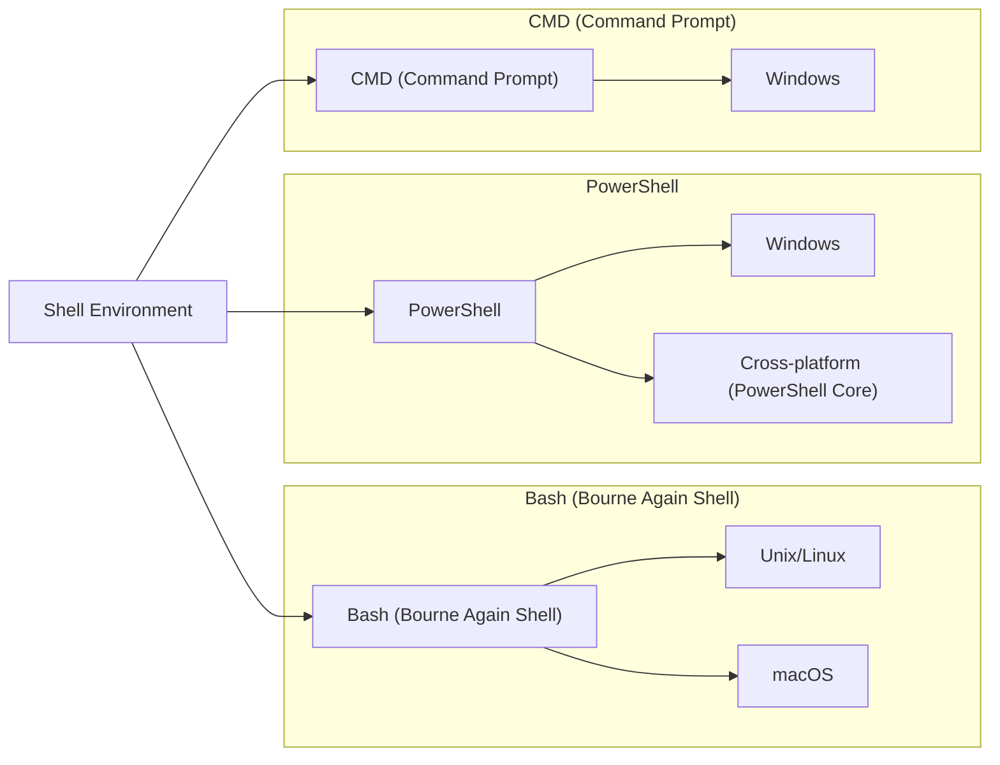

# BASH - Bourne Again Shell

### Before you start

#### What is Shell?

**Shell** is a type of computer program called a command-line interpreter that lets Linux and Unix users control their operating systems with command-line interfaces. Shells allow users to communicate efficiently and directly with their operating systems. 

<div style="text-align:center">
    
</div>

#### What is Bash?

**Bash** is a command-line interpreter that runs in a text window and allows the user to interpret commands to do various tasks. A Shell Script is a sequence of these commands contained within a single file. A Shell Script can be read and executed using Bash.

#### Difference between Bash and Shell

Bash is a command-line interpreter that runs in a text window and allows the user to interpret commands to do various tasks. A Shell Script is a sequence of these commands contained within a single file. A Shell Script can be read and executed using Bash.

> [Shell vs BASH vs PowerShell vs CMD](https://medium.com/@ayogun/shell-vs-bash-vs-powershell-vs-cmd-fa916895aab#:~:text=Bash%20is%20a%20command%2Dline,read%20and%20executed%20using%20Bash.) - A. Yigit Ogun at Medium



## Hello World Program - Bash

```bash
#!/bin/bash

echo "Hello, World!"
```

### How to run a Bash script?

1. **Make the script executable**:
    ```bash
    chmod +x script.sh
    ```
2. **Run the script**:
    ```bash
    ./script.sh
    ```